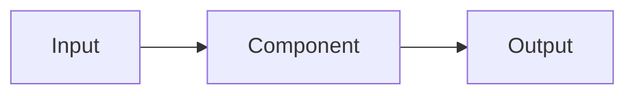

# Architecture

> Status: TBD. Fill this in during the Foundation phase (before Review 1) and keep it updated.

## Overview

TBD. One paragraph on how the system works end to end.

## Components

| Component | Responsibility | Location in repo | Owner |
|---|---|---|---|
| TBD | TBD | `src/...` | `<add GitHub username>` |

## Data flow

TBD. Add a diagram if it helps. Mermaid renders directly on GitHub:

## Key decisions

| Decision | Alternatives considered | Reason | Date |
|---|---|---|---|
| TBD | TBD | TBD | TBD |

## Open questions

- TBD
